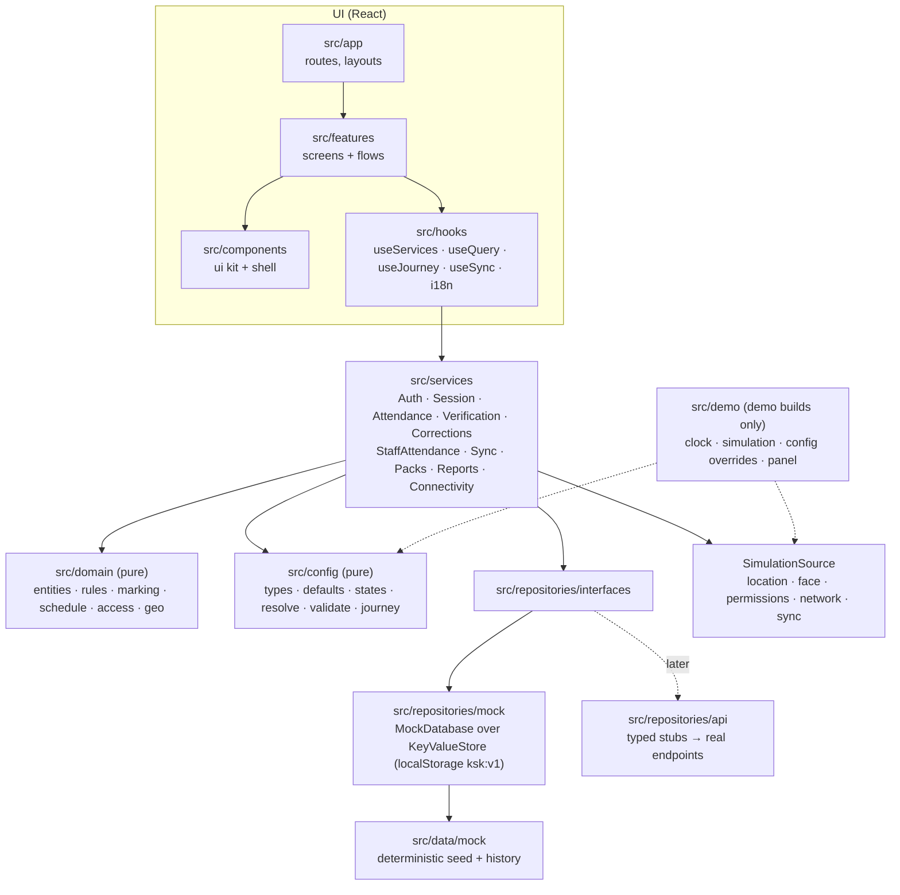
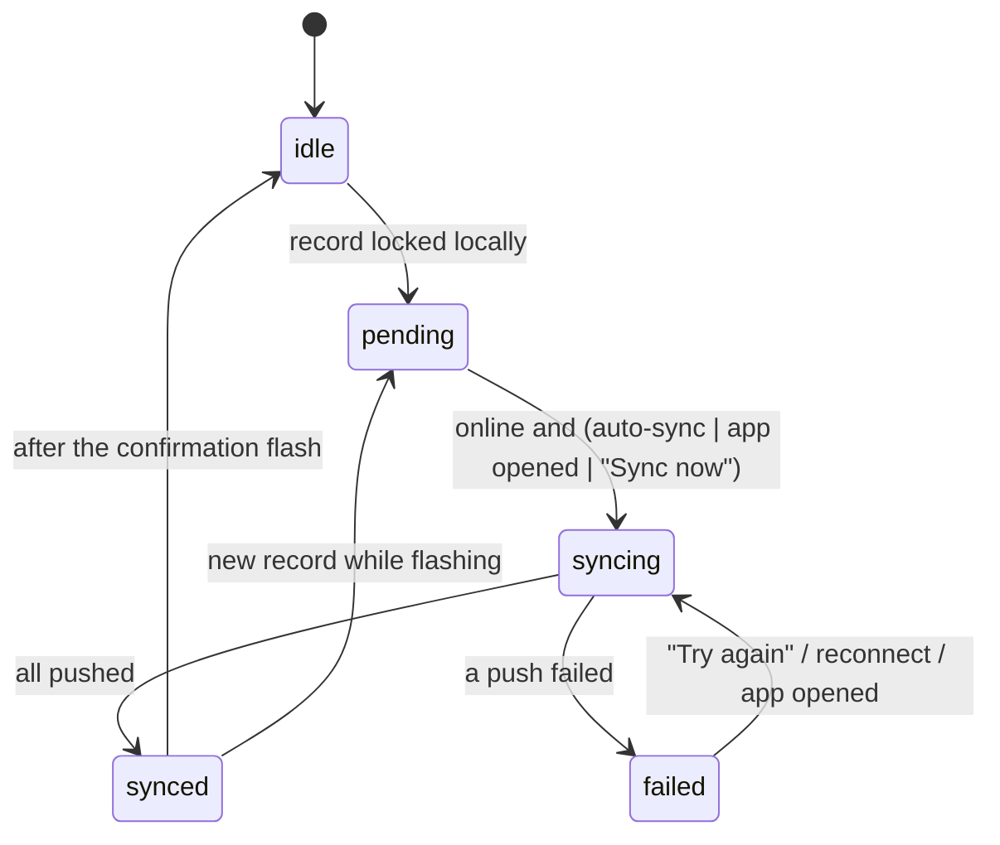
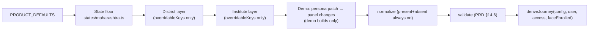

# Architecture

## Shape of the app

This is a **client-first, offline-capable** Next.js 16 App Router app. Every route is prerendered as a static shell, and all data work happens in the browser through services. There are no Server Actions or route handlers in v1: the mock "server" runs in the browser, so the whole demo works offline and deploys to Vercel as static files.



Dependency rules are enforced in `eslint.config.mjs`:

| Layer | May import | Must not import |
|---|---|---|
| `src/app`, `src/features`, `src/components`, `src/hooks` | hooks, components, services' **types**, domain, config types, i18n, lib | `@/data/*`, `@/repositories/mock|api`, `@/demo/*`; `journey.isPrincipal` |
| `src/services` | domain, config, repository interfaces, lib | mock data and demo code (only `container.ts`, the composition root, wires the mocks) |
| `src/domain`, `src/config` | each other, lib | React, Next, services, repositories, hooks, components |

## Boot sequence

```mermaid
sequenceDiagram
  participant L as RootLayout (static)
  participant P as AppProviders (client)
  participant B as bootApp()
  participant C as createMockContainer
  participant S as SessionProvider
  L->>P: render; BootSplash until ready
  P->>B: useEffect → bootApp()
  alt NEXT_PUBLIC_DEMO_MODE === 'true'
    B->>B: import('@/demo/adapters') → DemoClock, DemoSimulationSource, DemoConfigOverrides
  else demo off
    B->>B: systemClock, StaticSimulationSource, real connectivity + Geolocation
  end
  B->>C: store(ksk:v1), prefs(ksk-prefs), clock, simulation, overrides
  C-->>B: { repositories, services, bus, clock, simulation }
  B->>B: sync.start() (listens to connectivity; sends leftover queue if online)
  P->>S: ServicesProvider → I18nProvider → SessionProvider → ToastProvider
  S->>S: session.load() → SessionContext { user, institute, config, access, journey, data, clock }
```

`SessionContext` (`src/services/context.ts`) is the snapshot every service call receives: who the user is, their institute, the **resolved configuration**, their **access scope** (which trades and batches they can reach), the **journey** (which steps and controls exist), master data, and the clock. When the configuration changes (in the demo panel), the session reloads and every query refreshes.

## Data flow in the UI

- `useServices()` returns the service instances. Screens never touch repositories.
- `useQuery(key, fetcher, topics)` is a small stale-while-revalidate hook. It re-runs when its key changes or when a repository emits one of its `topics` on the `EventBus` (`session`, `config`, `attendance`, `corrections`, `staff`, `face`, `verification`, `offline`, `packs`, `preferences`, `demo`). It keeps the last data while refreshing, so lists never flash empty.
- `useSyncStatus()` subscribes to `SyncService` through `useSyncExternalStore`.
- Translated strings are produced at render time (`useI18n()`). Services return data, not copy.

## Routing

All routes are static. IDs travel in the query string, so every page can be prerendered and a soft navigation needs no server round trip:

| Route | Screen |
|---|---|
| `/` | Entry redirect (session → `/home`, else `/login`); `?preset=` applies a demo preset |
| `/login`, `/login/institute`, `/login/trainer`, `/login/identity` | Institute code → confirm → Trainer ID → confirm |
| `/face?next=` | Face setup (simulated), then continue to `next` (validated by `safeNext`) |
| `/home` | Instructor home, or institute overview for the principal |
| `/attendance` | Class selection (trade picker, assigned batches, timetable, or institute view) |
| `/attendance/trade?id=` | One trade's batches |
| `/attendance/open?s=` | Gateway: permission primer → verification → roster, or a problem screen |
| `/attendance/mark?s=` → `/review?s=` → `/submitted?s=` | Roster, review and confirm, result |
| `/attendance/record?s=` | Read-only record (principal: correction entry points) |
| `/attendance/correct?s=&student=` | Principal correction with reason |
| `/attendance/staff` | Principal staff marking |
| `/me/attendance` | Self attendance |
| `/reports`, `/reports/view?r=&range=` | Report list and report detail (print view) |
| `/profile`, `/profile/offline`, `/profile/offline/download` | Profile, offline data, download batches |

`s` is a **session key**: `batchId.date.slot[.subjectId]`, for example `ele-s1u2.2026-09-25.daily`, `ele-s1u2.2026-09-25.p3` or `ele-s1u1.2026-09-25.daily.es`.

## Where the rules live

| Rule | Pure policy | Enforced by |
|---|---|---|
| Submit once, then locked (INV-01/03) | `checkSubmission` → `already_submitted` | `AttendanceService.submit`; `MockAttendanceRepository.createSubmission` does an atomic check-and-set; `saveDraft` refuses after submit |
| No backdating (INV-05/06) | `checkSubmission` / `checkCorrection` → `not_today` | every write path |
| Hard time fence, no grace (INV-20) | `windowState` → `window_not_open` / `window_closed` | `openRoster` and `submit` |
| Verify before the list (INV-16) | `VerificationService.hasPass` | `openRoster` and `submit` require a pass for (user, session, today) |
| Blank default: every row marked; half-day half and leave type chosen | `completenessIssues` → `incomplete` | `submit`; roster footer explains what is missing |
| Principal-only, same-day, reason, real change, not OJT, synced first | `checkCorrection` | `CorrectionService.correct`; corrections are append-only |
| One staff mark per person per day; self precedence | `checkStaffMark` | `StaffAttendanceService`; principal batch-save returns `{ saved, skipped }` |
| Access scope | `resolveAccess` / `canMarkBatch` | `openRoster` and `submit` → `no_access` |
| Disabled means absent | `deriveJourney` | UI renders from the journey; services skip geo/face calls when off |

Errors are typed `Result` values (`src/lib/result.ts`). Services throw only for programmer errors or `NotImplementedError`.

## Offline and sync

Every write (online or offline) takes the same path. The record is **stored and locked on the device first**, then queued, then pushed.



- `SyncService` (`src/services/sync.ts`) owns the state machine. It is exposed through `ConnectivityBanner` (offline / syncing / failed + Try again / synced), the home "waiting to sync" card, and Profile → Offline data.
- Offline marking needs a **downloaded batch pack** (`BatchPackService`). A pack older than `offline.refreshDays` shows a "may be missing new admissions" warning on the roster.
- The principal's view shows only what has reached the server. An unsynced record cannot be corrected (`not_synced`).
- Real offline navigation in a WebView would need a service worker for the static shells. That work belongs to production hardening, not this build.

## Configuration resolution



See [CONFIGURATION.md](CONFIGURATION.md) for every option.

## Demo isolation

- All demo code is in `src/demo`. Two places load it, each through an inline `process.env.NEXT_PUBLIC_DEMO_MODE === 'true'` comparison so the bundler can drop the branch: `bootApp()` (adapters) and `AppProviders` (the `DemoRoot` panel).
- `npm run check:demo` builds with the flag off and fails if any demo marker string reaches the static output.
- Demo state lives in its own namespace (`ksk-demo:v1`). Reset Demo clears `ksk:v1`, `ksk-demo:v1` and `ksk-prefs`, then reloads.

## Storage namespaces

| Namespace | Owner | Contents |
|---|---|---|
| `ksk:v1` | `MockDatabase` | submissions, drafts, corrections, staff records, face enrolments (simulated), verification passes, offline queue, batch packs, session, seed marker |
| `ksk-prefs` | `DevicePreferencesRepository` | language (read before hydration by the boot script in `layout.tsx`) |
| `ksk-demo:v1` | `DemoStateRepository` | preset, config overrides, simulation, clock |

`LocalStorageStore` throws `StorageWriteError` when a write fails (quota or private mode). `createDefaultStore` falls back to an in-memory store when the WebView blocks or lacks localStorage.

## Going live (what replaces the mocks)

1. **Implement `src/repositories/api/*`.** Each stub documents its endpoint. Wire them in a new `createApiContainer()` beside `createMockContainer()`. No screen changes.
2. **Authentication.** Replace `MockAuthService` with SwiftChat identity (or institute code + Trainer ID + a second factor, PRD open question 1). Tokens must stay out of client code; use the host bridge or httpOnly cookies from an API.
3. **Face verification.** Implement `FaceVerificationService` against a real liveness and matching provider, with consent, data retention and on-device or server matching decided by the state. The current implementation is a simulation.
4. **Location.** `BrowserLocationProvider` exists. Confirm that the SwiftChat WebView grants geolocation, or add a host bridge.
5. **Offline shells.** Add a service worker (or the host's cache) so routes load with no network.
6. **Server-side rules.** The server must re-check every invariant in `src/domain/rules.ts`. The client checks are for UX, not trust.
7. **Set `NEXT_PUBLIC_DEMO_MODE=false`** in production, then run `npm run check:demo`.
